# Database Entity Relationship Diagram (ERD)

This diagram visualizes the relationships between the core collections in the Architect Studio MongoDB database.

```mermaid
erDiagram
    USER ||--o{ TOKEN : "creates"
    TEMPLATE ||--o{ SURVEY : "blueprint for"
    SURVEY ||--o{ TOKEN : "generates"
    TOKEN ||--o| RESPONSE : "finalized by"
    SURVEY ||--o{ RESPONSE : "contains"

    USER {
        string username PK
        string email
        string hashed_password
        boolean is_active
        datetime created_at
    }

    TEMPLATE {
        objectId _id PK
        string name
        int version
        string type
        object layer1_structure
        object layer2_structure
        boolean is_deleted
        datetime created_at
    }

    SURVEY {
        objectId _id PK
        string company_name
        string template_id FK
        int template_version
        object template_snapshot_schema
        string status
        string google_form_id
        datetime created_at
    }

    TOKEN {
        string token PK
        string survey_id FK
        string status
        string phone
        string batch_id
        datetime expires_at
        datetime created_at
    }

    RESPONSE {
        objectId _id PK
        string survey_id FK
        string token FK
        string phone
        object answers
        string source
        datetime submitted_at
    }

    ORPHAN_SUBMISSION {
        objectId _id PK
        object payload
        string reason
        datetime timestamp
    }
```

## Collection Relationships

### 1. Template & Survey
- A **Survey** is an immutable instance of a **Template**.
- When a survey is created, it takes a "Snapshot" of the template structure to ensure that if the original template is modified, the active survey remains consistent.

### 2. Survey & Token
- A **Survey** can have thousands of unique **Tokens**.
- Tokens are used as access keys for respondents to enter the funnel.

### 3. Token & Response
- A **Response** is the final state of a **Token**.
- Once a respondent completes the Google Form, the webhook maps the `token` back to the submission record to finalize the loop.

### 4. User
- **Users** (Admins) create templates and generate tokens.
- Currently, the relationship is logical (tracked via `created_by` strings) as the system is stateless regarding session-to-token strict ownership.
